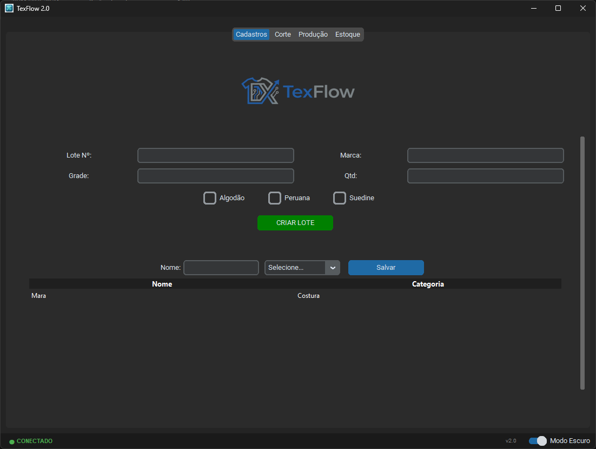
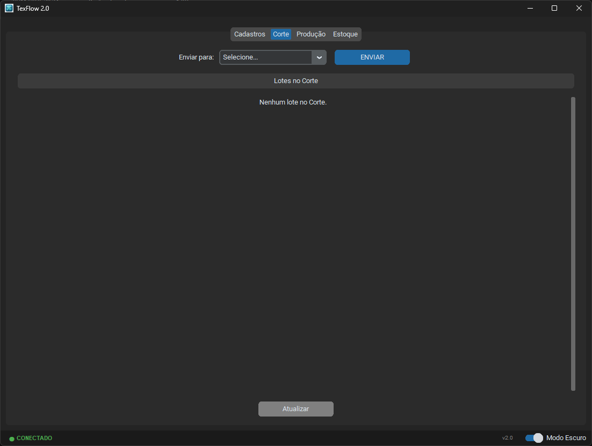
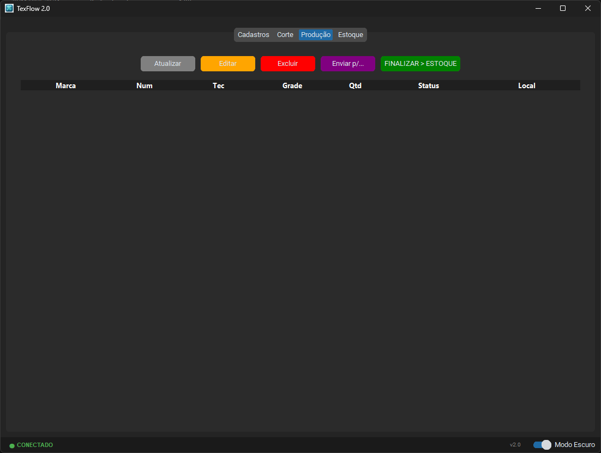
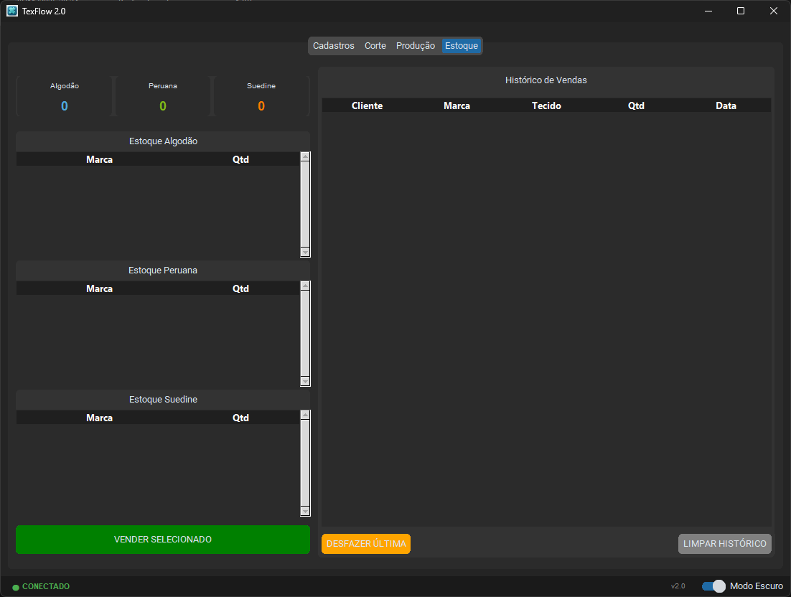
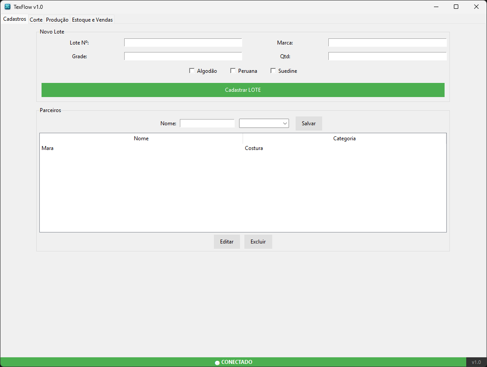

# 👕 TexFlow 2.0

**Sistema Inteligente de Gestão para Confecções Têxteis.**

O **TexFlow** é uma solução completa desenvolvida em Python para gerenciar o ciclo de vida de produção de roupas, desde o corte do tecido até a venda final, com controle de estoque em tempo real na nuvem.

---

## 🚀 Funcionalidades Principais

### 🏭 Controle de Produção
- **Rastreamento de Lotes:** Acompanhe cada lote (Corte -> Costura -> Acabamento -> Estoque).
- **Status Dinâmico:** O sistema identifica automaticamente o setor (ex: "Na Costura", "No Silk", "No Embolso") baseando-se no parceiro selecionado.
- **Gestão de Parceiros:** Cadastro de prestadores de serviço com categorias específicas.

### 📦 Estoque & Vendas
- **Estoque em Nuvem:** Sincronização em tempo real via MongoDB Atlas.
- **Venda Rápida:** Seleção direta na tabela de estoque com baixa automática.
- **Histórico e Correção:** Log completo de vendas com função de **"Desfazer Venda"** (estorno de estoque).
- **Visualização:** Tabelas separadas por tipo de tecido (Algodão, Peruana, Suedine).

### 🛡️ Segurança & Tecnologia
- **Autenticação Blindada:** O sistema busca as credenciais do banco de dados em um **Repositório Privado** no GitHub, garantindo que a senha nunca fique exposta.
- **Configuração Oculta:** Criação de arquivo `config.ini` oculto no sistema do cliente.
- **Auto-Updater:** Sistema de atualização automática (OTA) integrado ao GitHub Releases. O cliente sempre tem a última versão.

### 🎨 Interface Moderna
- **Design Responsivo:** Adapta-se a monitores pequenos (720p) e grandes (1080p+).
- **Dark/Light Mode:** Alternância de tema nativa.
- **Ícone e Logo:** Identidade visual integrada.

---

## 🛠️ Tecnologias Utilizadas

- **Linguagem:** Python 3.11
- **Interface Gráfica:** CustomTkinter (Modern UI) & Tkinter (Treeview)
- **Banco de Dados:** MongoDB Atlas (NoSQL)
- **Bibliotecas:** - `pymongo` & `certifi` (Conexão DB)
    - `requests` (API GitHub e Updates)
    - `pillow` (Manipulação de Imagens)
    - `pyinstaller` (Compilação EXE)

---

📦 Instalação (Para Clientes)
Baixe a última versão na aba Releases.

Coloque o arquivo TexFlow.exe em uma pasta de sua preferência.

Execute o programa.

Na primeira execução, digite seu Nome de Cliente para ativar a licença e conectar ao banco de dados.

---

## 📸 Galeria de Evolução (Screenshots)

Aqui você pode ver a evolução visual do projeto, desde a primeira versão até o design moderno atual.

<strong>✨ Versão 2.0 (Atual - Design Moderno & Dark Mode)</strong>

 

> A versão atual conta com interface CustomTkinter, Modo Escuro nativo e ícones integrados.

| Tela Inicial | Produção |
| :---: | :---: |
|  |  |

| Produção | Vendas |
| :---: | :---: |
|  |  |

<strong>🏚️ Versão 1.0 (Legado - Visual Clássico)</strong>

 

> A primeira versão utilizava interface nativa do Windows (Tkinter Padrão) e layout cinza.

---

Desenvolvido por SugarFoot Versão Atual: 2.0
